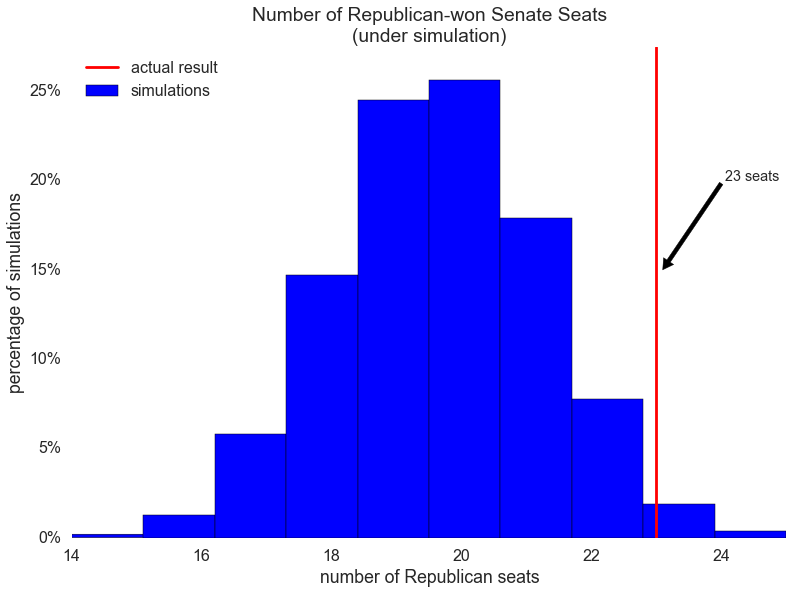
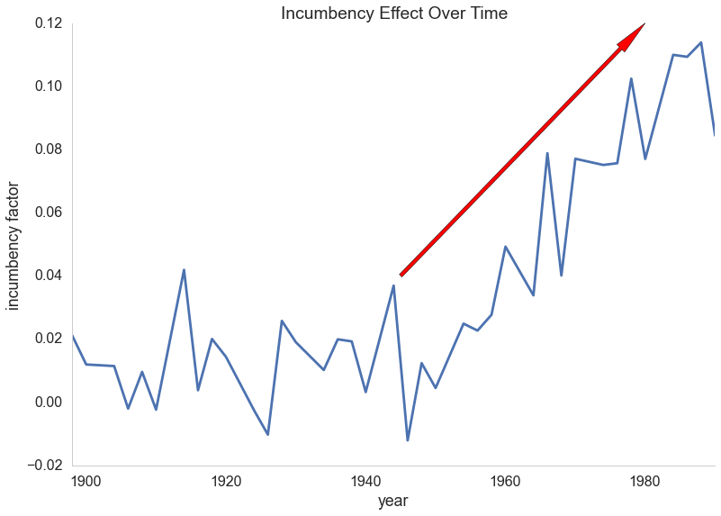
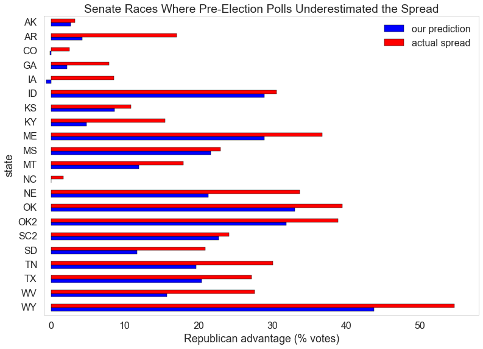

# No Polls Please, We're Republican

#### Predictions for this year's Senate elections were noticeably off the mark -- but the anomaly may be less about pollsters failing to engage the Republican voter than overestimating Democratic turnout at the ballot box.

On November 4, 2014, the Republican Party regained control of the Senate, a feat they had not accomplished since 2007. The road to Senate majority was not easy: the Republicans needed to gain six seats from the Democratic Party to reach that goal. In the end, they managed to surprise most forecasters by winning **nine** of those seats -- while successfully holding their own -- enroute to a decisive victory.

Prior to the election we predicted the Republicans would win 20 seats. We had not anticipated the final tally of 23 seats to be likely.

We were not alone. 

Pollsters across the nation came up short in their estimates, with predictions that similarly failed to capture the full extent of the Republican win.

In the aftermath of the election, we came to another disturbing conclusion: *voter polls* upon which we based our predictions **consistently underestimated** the number of Republican votes. 

If voter polls are supposed to be representative of the electorate, why were polling numbers so off? Why did they specifically favor Democrats over Republicans? Are pollsters not actively engaging the Republican voter? Are Republicans avoiding polls *en masse*? 

In this article, we'll review our failed predictions in an effort to answer these pressing questions. And in doing so, we'll endeavor to explain why nearly everyone embarrassingly missed the mark.

## The magic number is...

Prior to the elections, we obtained results of hundreds of polls and combined them to arrive at a prediction of the *average vote spread* by state. *Spread* is the difference between the vote percentages of two parties. So, for example, if the Republicans were to win 55% of the vote, and the Democrats 45%, then the spread would be +10 in the Republicans' favor. 

Naturally, different polls provide different estimates of spread, and so we averaged those estimates to obtain a neutral measure. We then ran multiple simulations to arrive at our prediction. 

We see the bulk of simulations put the Republicans at around **19-21 seats**. The shorter bars suggest numbers outside this range were unlikely. 

Much to our chagrin (and surely that of many Democrats), the Republicans ultimately won **23** out of 35 possible Senate seats. Our model had failed.

## Building on Momentum: The Incumbency Effect

Given Senate elections for a state occur relatively infrequently compared to elections of House representatives, we analyzed House election data for trends that might help us make predictions in the former domain.

We observed that *incumbents* -- candidates who won in the preceding election -- appeared to hold a significant advantage when running for re-election. We coined this the "incumbency effect", and measured its impact on voting patterns over time. 

A recent, steady upward trend appears evident, suggesting an incumbent is likely to enjoy a decided advantage over their opponent. Based on this information, we updated our prediction model for the Senate election. The result?  

A prediction of *21 seats*.  Short, once again. 

## The Republicans come marching in

Being off by a few seats might not be as troubling as the fact that predictions of the Republican's share of the vote consistently fell short of the actual turnout.

In nearly two-thirds of Senate races, our predicted spread representing the Republican advantage underestimated spreads that materialized on election day.

The source of this error is not obvious. Is there a problem with the polling data? Or is the problem in the way we're using it?

## Just because you *can* vote doesn't mean you *will*

We've since realized relying too heavily on the "incumbency effect" can lead to inaccurate predictions. One fact **is** clear: polling data *for Senate elections* seems to favor Democratic voters -- and this is a problem. 

Although one possible explanation is that Republicans are underrepresented in Senate election polling, perhaps the more plausible reason is that Democratic voter turnout for midterm elections is being overestimated. 

We should explore whether there exists a difference between "likely voter" and "registered voter" polls; treating the results of both types equally can result in *bias* particularly if a large group of voters from one party who **can** vote, simply choose not to. If this is the case, we may need to weigh "likely voter" polling data more appropriately.